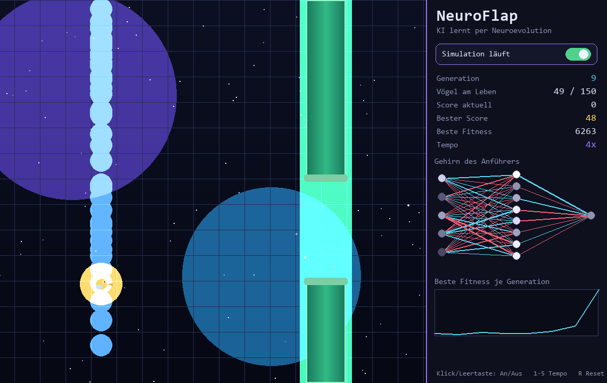

# 🧠🐦 NeuroFlap

Eine **KI, die sich vor deinen Augen selbst das Spielen beibringt.** Eine Population von
150 Vögeln lernt per **Neuroevolution** Flappy Bird zu meistern – neuronale Netze **und**
der genetische Algorithmus sind komplett *from scratch* implementiert, ganz ohne
ML-Bibliothek. Nur `pygame` für die Darstellung.



## 🚀 Der Wow-Moment

Du startest, und **alle Vögel sind hilflos** – sie stürzen sofort ab. Doch mit jeder
Generation werden die Netze besser. Nach wenigen Generationen kippt es plötzlich:

```
Generation  1: beste Fitness   445   bester Score  2
Generation  6: beste Fitness   726   bester Score  4
Generation  7: beste Fitness  1475   bester Score 10
Generation  8: beste Fitness  6263   bester Score 48   ← Durchbruch!
```

Ab hier fliegen die besten Vögel praktisch endlos. **Niemand hat ihnen gezeigt, wie –
sie haben es sich selbst beigebracht.**

## ✨ Features

- **Neuronales Netz from scratch** – Feedforward-Netz (5 → 8 → 1) mit tanh/sigmoid,
  komplett in reinem Python ([`neural_net.py`](neuroflap/neural_net.py)).
- **Genetischer Algorithmus** – Turnier-Selektion, Uniform-Crossover, gaußsche Mutation,
  Elitismus ([`genetic.py`](neuroflap/genetic.py)).
- **Live-Visualisierung des besten Gehirns** – Neuronen und gewichtete Verbindungen in
  Echtzeit (cyan = positiv, rot = negativ), aktive Neuronen leuchten.
- **Fitness-Graph** – die beste Fitness pro Generation als Lernkurve.
- **Schwarm-Ansicht** – alle 150 Vögel gleichzeitig; der aktuelle Anführer ist golden.
- **Zeitraffer** – Tempo bis 30× hochdrehen, um das Lernen im Schnelldurchlauf zu sehen.

## 🎮 Steuerung

| Taste | Aktion |
| --- | --- |
| `1` – `5` | Tempo (1× / 2× / 4× / 8× / 30×) |
| Klick auf den Schalter / `Leertaste` / `P` | Simulation an/aus (startet eingeschaltet) |
| `R` | Reset – neue, zufällige Population |
| `Esc` | Beenden |

## 🧬 Wie es funktioniert

Jeder Vogel wird von einem eigenen kleinen neuronalen Netz gesteuert. Es erhält fünf
normalisierte Eingaben und entscheidet pro Frame, ob geflattert wird:

1. Höhe des Vogels
2. Vertikale Geschwindigkeit
3. Horizontale Distanz zur nächsten Röhre
4. Abstand zur oberen Lückenkante
5. Abstand zur unteren Lückenkante

**Fitness** = Überlebenszeit + Bonus je passierter Röhre. Sind alle Vögel gestorben,
bildet der genetische Algorithmus die nächste Generation:

```
Beste behalten (Elite)  ──►  Turnier-Selektion der Eltern
                                     │
                            Uniform-Crossover
                                     │
                              Mutation  ──►  neue Generation
```

So verbessert sich die Population über die Generationen – ganz ohne Backpropagation.

## 🛠️ Installation & Start

```bash
git clone <DEIN-REPO-URL>
cd neuroflap

python -m venv .venv
# Windows:
.venv\Scripts\activate
# macOS/Linux:
source .venv/bin/activate

pip install -r requirements.txt
python main.py
```

> Benötigt **Python 3.10+**.

## 🗂️ Projektstruktur

```
neuroflap/
├── main.py                 # Einstiegspunkt
├── neuroflap/
│   ├── config.py           # Fenster, Physik, Evolution, Farben
│   ├── neural_net.py       # Feedforward-Netz (from scratch)
│   ├── genetic.py          # Selektion, Crossover, Mutation
│   ├── bird.py             # Vogel-Physik + Netz-Steuerung
│   ├── pipe.py             # Röhren
│   ├── population.py       # Population & Evolution
│   ├── simulation.py       # Physik, Fitness, Hauptschleife
│   └── renderer.py         # Darstellung + Netz-Visualisierung
├── tests/                  # pytest-Suite (läuft ohne Fenster)
├── requirements.txt
└── pyproject.toml
```

Die gesamte KI- und Simulationslogik ist von der Darstellung getrennt und damit
**vollständig headless testbar**.

## 🧪 Tests

```bash
pip install pytest
pytest
```

Getestet werden das neuronale Netz (Forward-Pass, Genom-Roundtrip), die genetischen
Operatoren und die Simulation (Evolution, Kollision, Population).

## 📜 Lizenz

MIT – mach damit, was du willst.
